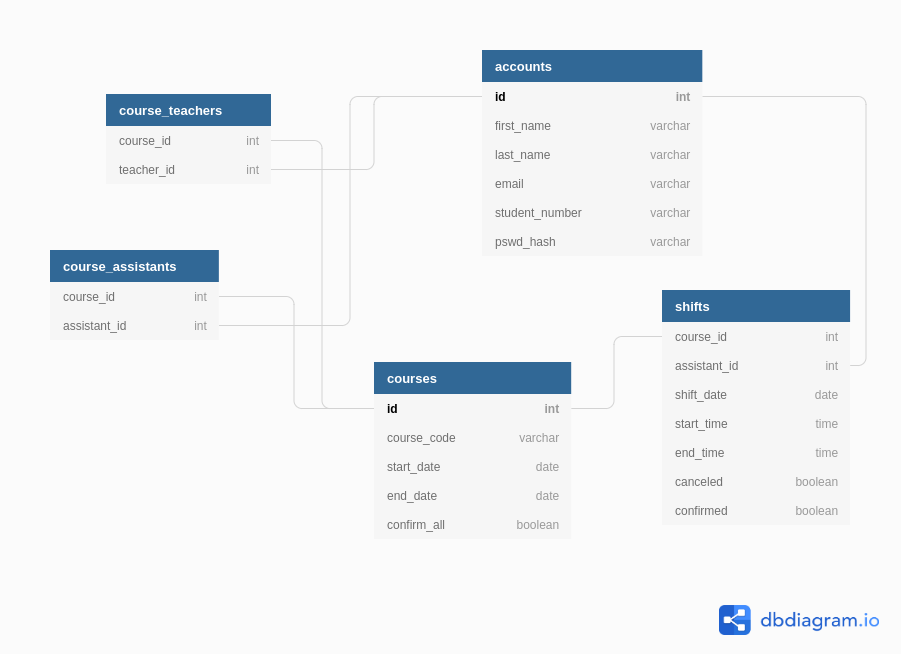

# Database schema documentation

The schema is mostly self-explanatory.

[Link to dbdiagram.io](https://dbdiagram.io/d/5f7866583a78976d7b763353)

**Shifts**

The `confirmed` switch is to indicate wether the shift is approved by a teacher of the course.

**Courses**

The `confirm_all` switch indicates that all shifts created for this course are confirmed by default. It means that the course teacher does not have to confirm any shifts.
